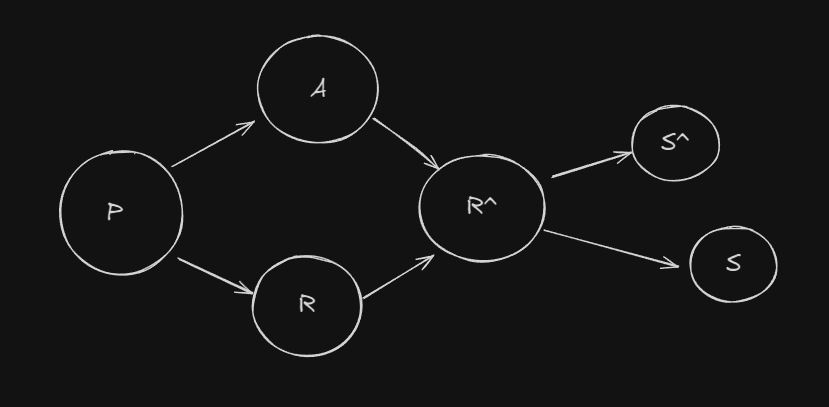

    <h1>TRABAJO PRÁCTICO FINAL MATEMÁTICA</h1>
    

## Equipo: Los Terreneitor

**Integrantes:**

- Batallón Costa, Juan Pablo
- Calcagni, Gabriel
- Jacob, Elías David
- Morales, Franco
- Rebolloso, Marina
- Salinas, Agustín
- Tomio, Maximiliano

 

# Caso 1: Calentamiento Global

 

## 1. Matriz de probabilidades de Calentamiento Global:

 

$$
\begin{Bmatrix}
\text{Año} & \text{Probabilidad de superar 1.5°C} \\
2022 & 0.48 \\
2023 & 0.48 \\
2024 & 0.48 \\
2025 & 0.48 \\
2026 & 0.48 \\
\end{Bmatrix}
$$

 

## 2. Cadena de Markov para los próximos 5 años

- Representación de la probabilidad de superar 1.5°C en los próximos 5 años:

 

$$
\begin{Bmatrix}
0.48 & 0.52 \\
0.48 & 0.52 \\
0.48 & 0.52 \\
0.48 & 0.52 \\
0.48 & 0.52 \\
\end{Bmatrix}
$$

 

## 3. Sistema de ecuaciones lineales

Definimos como variables las temperaturas promedio por año (periodo 2022-2026), superiores a los niveles preindustriales:

 

$$
\begin{align*}
T_1 & = 2022 \\
T_2 & = 2023 \\
T_3 & = 2024 \\
T_4 & = 2025 \\
T_5 & = 2026 \\
\end{align*}
$$

 

Para cada año, la temperatura media anual está entre 1.1°C y 1.7°C superior a los niveles preindustriales. Este conjunto se puede representar como el siguiente sistema de ecuaciones lineales:

 

$$
\begin{cases}
1.1 \leq T_1 \leq 1.7 \\
1.1 \leq T_2 \leq 1.7 \\
1.1 \leq T_3 \leq 1.7 \\
1.1 \leq T_4 \leq 1.7 \\
1.1 \leq T_5 \leq 1.7 \\
\end{cases}
$$

 

## 4. Conjuntos

#### Definiciones de conjuntos y probabilidades:

- _𝐴_: Años en los que la temperatura media anual del planeta supere 1,5°C los niveles preindustriales.

$$∣𝐴∣=5 (período 2022-2026)$$

$$𝑃(𝐴)= 50\%$$

- _B_: Años en los que la temperatura mundial cerca de la superficie supere en 1,5°C los niveles preindustriales.

$$∣𝐵∣= 5$$

$$𝑃(𝐵)= 48\%$$

- _C_: Período 2022-2026 se convierta en el más cálido jamás registrado.

$$∣𝐶∣=5$$

$$𝑃(𝐶)= 93\%$$

 

## 5. Relaciones

- _A_: Años en los que la temperatura media anual del planeta supere 1,5°C los niveles preindustriales.

$$
|A| = 5 \quad P(A) = 50\%
$$

- _B_: Años en los que la temperatura mundial cerca de la superficie supere en 1,5°C los niveles preindustriales.

$$
|B| = 5 \quad P(B) = 48\%
$$

- _C_: Período 2022-2026 se convierta en el más cálido jamás registrado.

$$
|C| = 5 \quad P(C) = 93\%
$$

 

### Relaciones entre los conjuntos

#### Probabilidades conjuntas y condicionales:

1. _Probabilidad conjunta_:

$$
P(A \cap B \cap C) = P(A) \times P(B) \times P(C) = 0.50 \times 0.48 \times 0.93 \approx 0.2232 \ (22.32\%)
$$

2. _Probabilidad de \(A\) dado \(C\)_:

$$
P(A|C) = \frac{P(A \cap C)}{P(C)} = \frac{P(A) \times P(C)}{P(C)} = P(A) = 50\%
$$

3. _Probabilidad de \(B\) dado \(C\)_:

$$
P(B|C) = \frac{P(B \cap C)}{P(C)} = \frac{P(B) \times P(C)}{P(C)} = P(B) = 48\%
$$

### Intersecciones de conjuntos:

1. _Intersección (A B)_:

$$
P(A \cap B) = P(A) \times P(B) = 0.50 \times 0.48 = 0.24 \ (24\%)
$$

2. _Intersección (A C)_:

$$
P(A \cap C) = P(A) \times P(C) = 0.50 \times 0.93 = 0.465 \ (46.5\%)
$$

3. _Intersección (B C)_:

$$
P(B \cap C) = P(B) \times P(C) = 0.48 \times 0.93 = 0.4464 \ (44.64\%)
$$

### Relación combinada:

1. _Probabilidad conjunta total_:

$$
P(A \cap B \cap C) = P(A) \times P(B) \times P(C) = 0.50 \times 0.48 \times 0.93 \approx 0.2232 \ (22.32\%)
$$

## 6. Representación en Forma Lógica

1. Si las probabilidades de superar el umbral de 1.5°C han aumentado desde 2015, entonces esto indica un punto crítico para efectos climáticos perjudiciales.
2. Si no cesan las emisiones de gases de efecto invernadero, entonces las temperaturas seguirán aumentando, los océanos seguirán calentándose y volviéndose más ácidos, el hielo marino y los glaciares seguirán derritiéndose, el nivel del mar seguirá subiendo y las condiciones meteorológicas serán cada vez más extremas.
3. Si el aumento sostenido de la temperatura mundial continuará, entonces se prevé que la temperatura anual entre 2022 y 2026 será superior a los niveles preindustriales y habrá una probabilidad del 48% de superar 1.5 °C.
4. Si la media quinquenal de 2022-2026 supera los 1.5 °C, entonces se indicará una mayor proximidad a sobrepasar el umbral de París.
5. Si el calentamiento global supera el umbral de París del 1.5°C, entonces agravará riesgos climáticos actuales de los sistemas naturales y humanos.

**Lógica Formal:**

$$
\begin{align*}
P &: \text{si no cesan las emisiones de gases de efecto invernadero} \\
Q &: \text{entonces las temperaturas seguirán aumentando, los océanos seguirán calentándose y volviéndose más ácidos, el hielo marino y los glaciares seguirán derritiéndose, el nivel del mar seguirá subiendo} \\
R &: \text{entonces se prevé que la temperatura anual entre 2022 y 2026 será superior a los niveles preindustriales y habrá una probabilidad del 48\% de superar 1.5 °C} \\
R1 &: \text{Si el calentamiento global supera el umbral de París del 1.5°C} \\
S &: \text{entonces agravará riesgos climáticos actuales de los sistemas naturales y humanos} \\
S1 &: \text{y las condiciones meteorológicas serán cada vez más extremas} \\
\end{align*}
$$

**Formalización**:

$$
-p \rightarrow (q \land r) \rightarrow r1 \land (s \land s1)
$$

    

