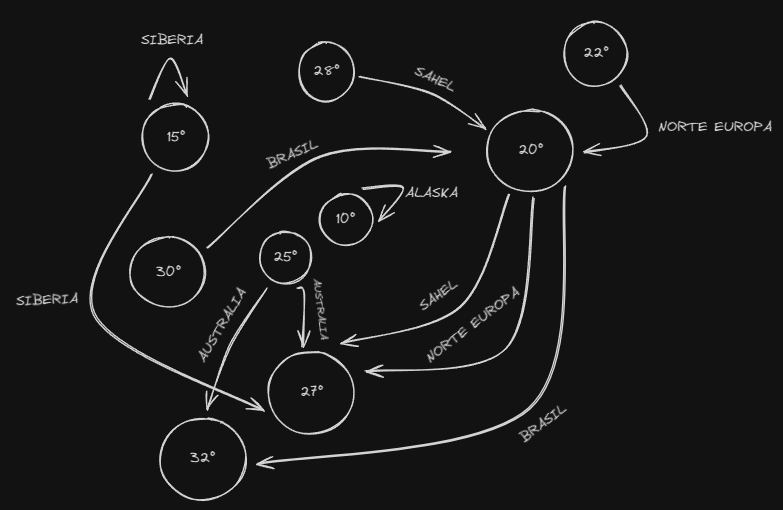
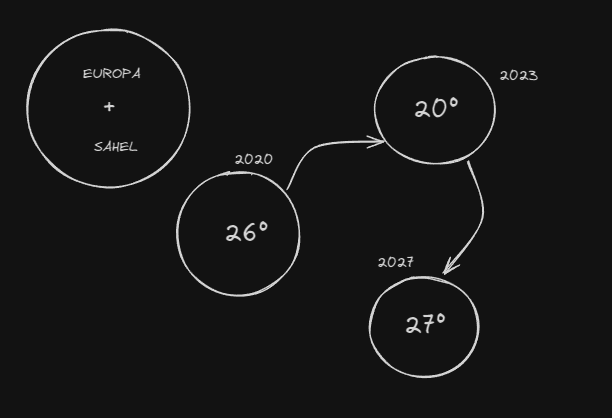
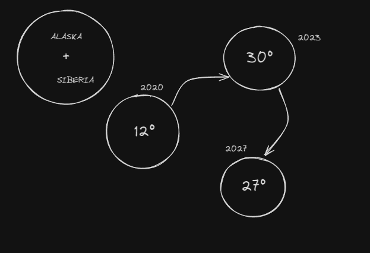
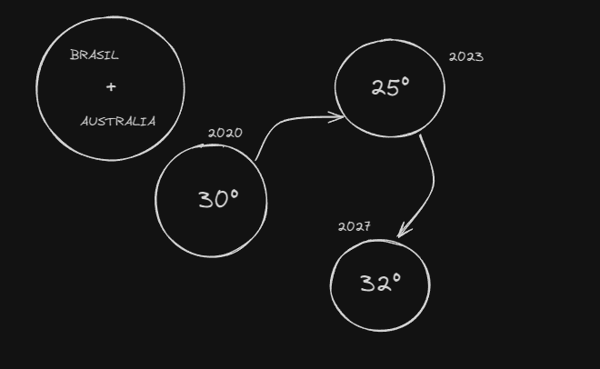

    <h1>TRABAJO PRÁCTICO FINAL MATEMÁTICA</h1>
    

## Equipo: Los Terreneitor

**Integrantes:**

- Batallón Costa, Juan Pablo
- Calcagni, Gabriel
- Jacob, Elías David
- Morales, Franco
- Rebolloso, Marina
- Salinas, Agustín
- Tomio, Maximiliano

 

# Caso 2: Precipitaciones y Temperatura (PT)

 

### Precipitaciones

## 1. Matriz de probabilidades de diferentes condiciones de lluvia en distintas regiones:

 

$$
\begin{array}{cccc}
\text{Región} & \text{Condición} & \text{Probabilidad} \\
\hline
\text{Suroeste de Europa} & \text{Seco} & 0.7 \\
\text{Suroeste de América del Norte} & \text{Seco} & 0.7 \\
\text{Norte de Europa} & \text{Lluvioso} & 0.6 \\
\text{Sahel} & \text{Lluvioso} & 0.6 \\
\text{Noreste de Brasil} & \text{Lluvioso} & 0.6 \\
\text{Australia} & \text{Lluvioso} & 0.6 \\
\text{Alaska} & \text{Lluvioso} & 0.6 \\
\text{Norte de Siberia} & \text{Lluvioso} & 0.6 \\
\text{Región Amazónica} & \text{Seco} & 0.7 \\
\end{array}
$$

 

## 2. Cadena de Markov

 

    

 

    

 

    

 

    

 

$$
\begin{table}[h!]
    \centering
    \begin{tabular}{c|ccc}
         & 2020 & 2023 & 2027 \\
        \hline
        E + S & 26 & 20 & 27 & 73 \\
        A + S & 12 & 30 & 27 & 64 \\
        B + A & 30 & 25 & 32 & 87 \\
    \end{tabular}
\end{table}
$$

$$
\begin{pmatrix}
    0.36 & 0.27 & 0.37 \\
    0.17 & 0.43 & 0.40 \\
    0.34 & 0.29 & 0.37
\end{pmatrix}
$$

$$
= (0.052 + 0.027 + 0.037) - (0.054 + 0.042 + 0.017)
$$

$$
= 0.112 - 0.113
$$

$$
P = -0.001
$$

$$
P^5 = -1 \times 10^{-15}
$$

Supongamos que el estado "seco" es \( S \) y "lluvioso" es \( L \). La matriz de transición para cada región se define a continuación.

#### Suroeste de Europa y Suroeste de América del Norte

Dado que la probabilidad de que sea "seco" es 0.7 y la probabilidad de que sea "lluvioso" es 0.3, la matriz de transición se ve así:

 

$$
\begin{pmatrix}
& S & L \\
S & 0.7 & 0.3 \\
L & 0.3 & 0.7 \\
\end{pmatrix}
$$

 

#### Norte de Europa, Sahel, Noreste de Brasil, Australia, Alaska y Norte de Siberia

Dado que la probabilidad de que sea "lluvioso" es 0.6 y la probabilidad de que sea "seco" es 0.4, la matriz de transición se ve así:

 

$$
\begin{pmatrix}
& S & L \\
S & 0.4 & 0.6 \\
L & 0.4 & 0.6 \\
\end{pmatrix}
$$

 

#### Región Amazónica

Dado que la probabilidad de que sea "seco" es 0.7 y la probabilidad de que sea "lluvioso" es 0.3, la matriz de transición se ve así:

 

$$
\begin{pmatrix}
& S & L \\
S & 0.7 & 0.3 \\
L & 0.3 & 0.7 \\
\end{pmatrix}
$$

### Temperaturas

Las temperaturas esperadas en estas regiones según el enunciado son:

- Suroeste de Europa y Suroeste de América del Norte: 30°C
- Norte de Europa: 20°C
- Australia: 25°C
- Sahel: 28°C
- Norte de Europa: 22°C
- Alaska: 15°C
- Norte de Siberia: 10°C
- Región Amazónica: 30°C
- Trópicos: 32°C
- Zonas Subtropicales: 27°C

 

## 3. Sistema de ecuaciones lineales para régimen pluvial y precipitaciones

### Definición de las variables a considerar

Tomamos la media histórica de precipitaciones considerada entre 1991 y 2020 como dato en común para nuestro sistema de ecuaciones lineales. Consideramos el promedio de precipitaciones por región para realizar las comparativas en los diferentes períodos mencionados:

- \( M \) = Media histórica (1991 a 2020)
- \( P_1 \) = Promedio de precipitaciones en Europa
- \( P_2 \) = Promedio de precipitaciones en América del Norte
- \( P_3 \) = Promedio de precipitaciones en el Sahel
- \( P_4 \) = Promedio de precipitaciones en Brasil
- \( P_5 \) = Promedio de precipitaciones en Australia
- \( P_6 \) = Promedio de precipitaciones en Alaska
- \( P_7 \) = Promedio de precipitaciones en Siberia
- \( P_8 \) = Promedio de precipitaciones en la región amazónica

 

### Sistemas de ecuaciones lineales

#### Mayo a Septiembre en los próximos 5 años

 

$$
\begin{cases}
P_1 = M + a_1 \\
P_2 = M + a_2 \\
P_3 = M + a_3 \\
P_4 = M + a_4 \\
P_5 = M + a_5 \\
P_6 = M + a_6 \\
P_7 = M + a_7 \\
P_8 = M + a_8 \\
\end{cases}
$$

 

Donde \( a_i \) representa el cambio en las precipitaciones respecto a la media histórica \( M \) para cada región \( i \).

#### Noviembre a Marzo 2022/2023 y 2026/2027

 

$$
\begin{cases}
P_1' = M + b_1 \\
P_2' = M + b_2 \\
P_3' = M + b_3 \\
P_4' = M + b_4 \\
P_5' = M + b_5 \\
P_6' = M + b_6 \\
P_7' = M + b_7 \\
P_8' = M + b_8 \\
\end{cases}
$$

 

Donde \( b_i \) representa el cambio en las precipitaciones respecto a la media histórica \( M \) para cada región \( i \) durante el período de noviembre a marzo entre 2022/2023 y 2026/2027.

 

## 4. Conjuntos

#### Definiciones de conjuntos:

- **_𝐷_**: Regiones con condiciones más secas.

$$
𝐷=\{ \text{Suroeste de Europa, Suroeste de América del Norte, Región Amazónica} \}
$$

- **_𝐸_**: Regiones con mayor pluviosidad.

$$
𝐸=\{ \text{Norte de Europa, Sahel, Noreste de Brasil, Australia, Alaska, Norte de Siberia, Trópicos} \}
$$

- **_𝐹_**: Regiones con aumento de temperatura.

$$
𝐹=\{ \text{Suroeste de Europa, Suroeste de América del Norte, Norte de Europa, Sahel, Alaska, Norte de Siberia, Región Amazónica, Trópicos, Zonas Subtropicales} \}
$$

 

## 5. Relaciones

- _D_: Regiones con condiciones más secas.

$$
D = \{ \text{Suroeste de Europa, Suroeste de América del Norte, Región Amazónica} \}
$$

- _E_: Regiones con mayor pluviosidad.

$$
E = \{ \text{Norte de Europa, Sahel, Noreste de Brasil, Australia, Alaska, Norte de Siberia, Trópicos} \}
$$

- _F_: Regiones con aumento de temperatura.

$$
F = \{ \text{Suroeste de Europa, Suroeste de América del Norte, Norte de Europa, Sahel, Alaska, Norte de Siberia, Región Amazónica, Trópicos, Zonas Subtropicales} \}
$$

#### Relaciones entre los conjuntos:

### Intersecciones:

1. _Intersección (D E)_:

$$
D \cap E = \{ \text{(vacío)} \} \quad \text{(No hay intersección, conjuntos disjuntos)}
$$

2. _Intersección (D F)_:

- Estas son las regiones que experimentan condiciones más secas y también un aumento de temperatura.

$$
D \cap F = \{ \text{Suroeste de Europa, Suroeste de América del Norte, Región Amazónica} \}
$$

1. _Intersección (E F)_:

- Estas son las regiones que experimentan mayor pluviosidad y también un aumento de temperatura.

$$
E \cap F = \{ \text{Norte de Europa, Sahel, Alaska, Norte de Siberia, Trópicos} \}
$$

### Uniones:

1. _Unión (D E)_:

$$
D \cup E = \{ \text{Suroeste de Europa, Suroeste de América del Norte, Región Amazónica, Norte de Europa, Sahel, Noreste de Brasil, Australia, Alaska, Norte de Siberia, Trópicos} \}
$$

2. _Unión (D F)_:

$$
D \cup F = \{ \text{Suroeste de Europa, Suroeste de América del Norte, Región Amazónica, Norte de Europa, Sahel, Alaska, Norte de Siberia, Trópicos, Zonas Subtropicales} \}
$$

1. _Unión (E F)_:

$$
E \cup F = \{ \text{Norte de Europa, Sahel, Noreste de Brasil, Australia, Alaska, Norte de Siberia, Trópicos, Suroeste de Europa, Suroeste de América del Norte, Región Amazónica, Zonas Subtropicales} \}
$$

### Relación combinada:

1. _Unión total (D E F)_:

$$
D \cup E \cup F = \{ \text{Suroeste de Europa, Suroeste de América del Norte, Norte de Europa, Sahel, Noreste de Brasil, Australia, Alaska, Norte de Siberia, Región Amazónica, Trópicos, Zonas Subtropicales} \}
$$

2. _Intersección total (D E F)_:

$$
D \cap E \cap F = \{ \text{(vacío)} \} \quad \text{(No hay intersección de los tres conjuntos)}
$$

 

## 6. Desglose en Proposiciones Lógicas

$$
\begin{aligned}
\\
& \text{Sección 1} \\
& \begin{aligned}
& Q: && \text{El régimen pluvial previsto para 2022 sugiere una mayor probabilidad de condiciones más secas en el suroeste de Europa y el suroeste de América del Norte.} \\
& Q1: && \text{El régimen pluvial previsto para 2022 sugiere una mayor probabilidad de una mayor pluviosidad en el norte de Europa, el Sahel, el noreste de Brasil y Australia.} \\
& T: && \text{Las temperaturas en el suroeste de Europa y el suroeste de América del Norte serán de 30°C.} \\
& T1: && \text{Las temperaturas en el norte de Europa serán de 20°C.} \\
& T2: && \text{Las temperaturas en Australia serán de 25°C.} \\
\end{aligned} \\
\\
& \text{Sección 2} \\
& \begin{aligned}
& P: && \text{En comparación con la media de 1991 a 2020, el promedio de las precipitaciones previstas entre mayo a septiembre de los próximos cinco años sugiere una mayor probabilidad de que se produzcan condiciones más lluviosas en el Sahel, el norte de Europa, Alaska y el norte de Siberia.} \\
& P1: && \text{En comparación con la media de 1991 a 2020, el promedio de las precipitaciones previstas entre mayo a septiembre de los próximos cinco años sugiere una mayor probabilidad de que se produzcan condiciones más secas en la región amazónica.} \\
& T3: && \text{Las temperaturas en el Sahel serán de 28°C.} \\
& T4: && \text{Las temperaturas en el norte de Europa serán de 22°C.} \\
& T5: && \text{Las temperaturas en Alaska serán de 15°C.} \\
& T6: && \text{Las temperaturas en el norte de Siberia serán de 10°C.} \\
& T7: && \text{Las temperaturas en la región amazónica serán de 30°C.} \\
\end{aligned} \\
\\
& \text{Sección 3} \\
& \begin{aligned}
& R: && \text{Para el período de noviembre a marzo entre 2022/2023 y 2026/2027 habrá más lluvias en los trópicos.} \\
& R1: && \text{Para el período de noviembre a marzo entre 2022/2023 y 2026/2027 habrá una reducción de las precipitaciones en las zonas subtropicales.} \\
& T8: && \text{Las temperaturas en los trópicos aumentarán a 32°C.} \\
& T9: && \text{Las temperaturas en las zonas subtropicales serán de 27°C.} \\
& S: && \text{Condiciones congruentes con los efectos previstos del calentamiento del clima.} \\
\end{aligned} \\
\\
& \text{Fórmula Lógica} \\
& \left[ \left( Q \land Q1 \land T \land T1 \land T2 \right) \rightarrow \left( P \land P1 \land T3 \land T4 \land T5 \land T6 \land T7 \right) \land \left( R \land R1 \land T8 \land T9 \right) \right] \rightarrow S \\
\end{aligned}
$$

